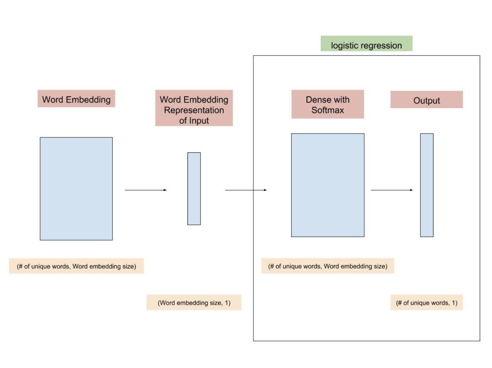

# GLM and GAM

Goal: To solve linear regression model "weak" assumption: gaussian distribution, no interaction, linear relationship ...

Component: link function, weighted sum, a probability distribution

For example: 
-  non-Gaussian outcomes: add a log function if it's a Poisson distribution
-  interactions: add a column to the feature matrix that represents the interaction between the features and fit the model as usual
-  non-linear effects: simple transformation of feature, categorization of the feature, GAM

GAM:

Interpret: Partial dependency plots

Tuning Smoothness and Penalties: n_spline, lam, constrains

1. https://christophm.github.io/interpretable-ml-book/extend-lm.html
2. https://codeburst.io/pygam-getting-started-with-generalized-additive-models-in-python-457df5b4705f
3. https://medium.com/just-another-data-scientist/building-interpretable-models-with-generalized-additive-models-in-python-c4404eaf5515

# Word2vec
Word2vec is a neural network structure to generate word embedding by training the model on a supervised classification problem. In the word2vec architecture, the two algorithm names are “continuous bag of words” (CBOW) and “skip-gram” (SG).

- 

1. Example: https://towardsdatascience.com/word2vec-from-scratch-with-numpy-8786ddd49e72

# BERT

Inportant: They employed masked language modeling. In other words, they hid 15% of the words and used their position information to infer them. Finally, they also mixed it up a little bit to make the learning process more effective.

InputExample Format(tsv): 
-  guid: Unique ID for the row
-  text_a: Text
-  text_b: A column of the same letter for all rows. BERT wants, but we don’t use
-  labels: The text for row (will be empty for test data)

InputFeature Requires:
-  Require: convert InputExample to InputFeature (purely numberical data)
-  Steps: 
    -  tokenizing embedding: tokenize the text, truncate the long sequence or pad the short sequence to the given sequence length (max 512, 128 ...)
    -  sentence embedding
    -  transformer positional embedding
    
InputFeature Format:
- input_ids: list of numberical ids for the tokenised text
- input_mask: will be set to 1 for real tokens and 0 for the padding tokens
- segment_ids: sigle sentence or multiple sentence
- label_ids: one-hot encoded labels for the text

Masked LM
- uncased BERT Base: 12 layers encoders, which embedding do you want, probably the sum of last 4 layer

Output
- "pooled_output" for classification tasks on an entire sentence
- "sequence_outputs" for token-level output

Estimate
- classification matrix

Next Sentence Prediction 

1. https://towardsdatascience.com/bert-explained-state-of-the-art-language-model-for-nlp-f8b21a9b6270
2. https://medium.com/swlh/a-simple-guide-on-using-bert-for-text-classification-bbf041ac8d04
3. https://towardsdatascience.com/nlp-extract-contextualized-word-embeddings-from-bert-keras-tf-67ef29f60a7b
4. [movie setiment analysis](https://github.com/google-research/bert/blob/master/predicting_movie_reviews_with_bert_on_tf_hub.ipynb)

# Neural Networks

Regularization:
-  dropout: randomly turn off certain parts of our network while training
    -  decide that during this epoch or this mini-batch, a bunch of neurons will be turned off
    -  assign each neuron with a probability ps at random
    -  decide of the threshold: a value that will determine if the node is kept or not
    -  dropout is only used during training time, during test time, all the nodes of our network are always present
-  data augmentation: instead of feeding the model with the same pictures every time, we do small random transformations (a bit of rotation, zoom, translation, etc…) that doesn’t change what’s inside the image (for the human eye) but changes its pixel values. 
-  weight decay: multiply the sum of squares with another smaller number to the loss function
    -  Loss = MSE(y_hat, y) + wd * sum(w^2), wd is the weight decay
    -  w(t) = w(t-1) - lr * dLoss / dw => d(wd * w^2) / dw = 2 * wd * w (similar to dx^2/dx = 2x)
    -  generally a wd = 0.1 works pretty well
 
1. https://becominghuman.ai/this-thing-called-weight-decay-a7cd4bcfccab
